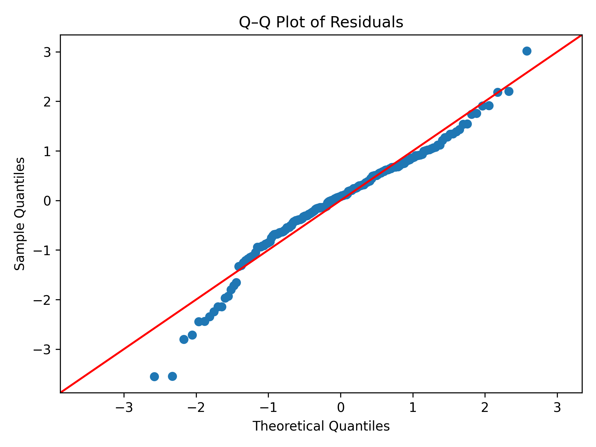
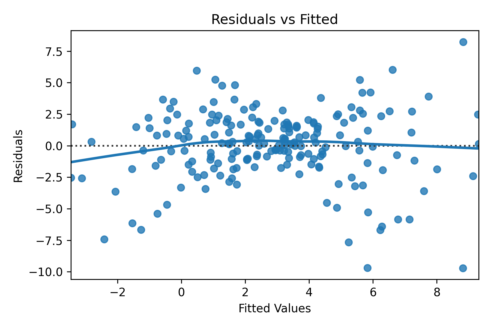
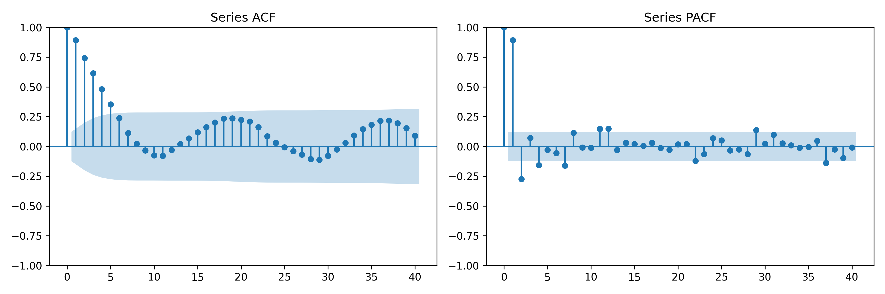

# 🧠 StatsmodelsMasterPro

[](https://www.gnu.org/licenses/gpl-3.0)
[](https://www.python.org/)
[](https://jupyter.org/)
[](https://www.statsmodels.org/)
[](https://streamlit.io/)
[](./synthetic_data/)

---

## 🎯 Project Goal

**StatsmodelsMasterPro** is a portfolio-grade project crafted to master **statistical modeling, inference, and diagnostics** using the [`statsmodels`](https://www.statsmodels.org/) library.

Instead of relying on real-world noise, this project uses **carefully designed synthetic data** to help you focus on **concepts, assumptions, syntax, and model diagnostics** — the way they were meant to be learned.

---

## 🚀 Key Features

✅ 16 concept-focused notebooks  
✅ Fully synthetic datasets (no domain noise)  
✅ Complete statistical diagnostics and CI/Bootstrap visualizations  
✅ Custom fallback implementations (e.g., Hotelling’s T² without Pingouin)  
✅ Common tests compared with `scipy.stats` (t-test, CI, KS, etc.)  
✅ Modular utility structure: `utils/` for reuse, `exports/` for outputs  
✅ Markdown cheatsheet for quick reference  
✅ Optional Streamlit dashboard support

---

## 💡 Why Synthetic?

Most tutorials use real-world datasets with domain-specific quirks. This project intentionally uses **carefully constructed synthetic data** to:

- Focus on statistical **principles** and **assumptions**
- Understand **inference over noise**
- Debug with **full control** over the generating process
- Build **intuition** before diving into messy real data

## 💼 Who This Is For

Perfect for:

- 📊 **Data Scientists** refining statistical intuition
- 🧠 **AI/ML Engineers** grounding predictions with inference
- 🧪 **Researchers** needing reproducible modeling templates
- 🎓 **Students** prepping for interviews, PhD, or coursework

---

## 🌱 Learning Outcomes

By the end, you’ll confidently:

- Model linear, logistic, and multivariate data
- Evaluate assumptions with professional-grade visuals
- Compare statistical methods between libraries
- Automate tests and diagnostics for any model
- Master the internals of `statsmodels` over black-box tools

---

## 🧱 Project Structure

```bash
StatsmodelsMasterPro/
├── notebooks/                 # Concept notebooks (OLS, GLM, ANOVA, etc.)
├── common_tests/              # Shared logic with Scipy, manual tests
├── cheatsheets/               # Condensed syntax & theory guides (Markdown)
├── exports/                   # All model outputs (plots, tables)
│   ├── plots/
│   └── tables/
├── synthetic_data/            # Dataset generation scripts and saved CSVs
├── utils/                     # Custom utilities: diagnostics, bootstrap, etc.
├── scripts/                   # Extra scripts, one-time jobs or tools
├── pages/                     # Streamlit multi-page UI files (if used)
├── streamlit_app/             # Streamlit dashboard logic and utils
├── sm_env/                    # Optional: environment setup or virtualenv storage
├── Home.py                    # Streamlit entry point
├── entrypoint.sh              # Entrypoint script for Docker (Jupyter/Streamlit)
├── Dockerfile                 # Docker build instructions
├── docker-compose.yml         # Compose setup for Jupyter/Streamlit modes
├── requirements.txt           # Core project dependencies
├── requirements_dev.txt       # Extended dev dependencies
├── .gitignore                 # Git exclusions
├── .dockerignore              # Docker context exclusions
└── README.md                  # Main documentation and overview

```

---

Perfect — let’s replace the demo image placeholders with actual **local plot references** using relative paths from within your `README.md`. Here's a clean markdown block you can directly **copy-paste** into your `README.md`, assuming you've placed your images in the `exports/plots/` folder.

---

## 📁 Visual Preview

Following are some of the plots from the project.

### 📊 Q–Q Plot from Residual Diagnostics

Used to assess normality of residuals:



> _(This can come from `07_model_diagnostics.ipynb`.)_

---

### 📈 Residuals vs Fitted Plot

To identify heteroskedasticity or nonlinearity:



---

### 🔄 ACF/PACF for Time Series

Used in `05_time_series_analysis.ipynb`:



---

## 🧪 Cheatsheets Summary

📁 `cheatsheets/` contains Markdown guides for quick revision:

| Cheatsheet               | Topics Covered                               |
| ------------------------ | -------------------------------------------- |
| `statsmodels_cheatsheet` | OLS, GLM, ANOVA, AIC/BIC, CI, diagnostics    |
| `docker_cheatsheet`      | Build, compose, volume, ports, entrypoints   |
| `streamlit_cheatsheet`   | Layouts, inputs, plot, export, session state |

---

## ⚙️ Installation & Development Setup

Follow these steps to set up your local development environment:

### 🔧 1. Clone the Repository

```bash
git clone https://github.com/your-username/StatsmodelsMasterPro.git
cd StatsmodelsMasterPro
```

### 🐍 2. Create and Activate Virtual Environment

#### For macOS/Linux

```bash
python3 -m venv sm_env
source sm_env/bin/activate
```

#### For Windows (CMD)

```cmd
python -m venv sm_env
sm_env\Scripts\activate
```

#### For Windows (PowerShell)

```powershell
python -m venv sm_env
.\sm_env\Scripts\Activate.ps1
```

### 📦 3. Install Required Dependencies

```bash
pip install --upgrade pip
pip install -r requirements.txt
```

> 💡 For development/testing extras, you can also install:

```bash
pip install -r requirements_dev.txt
```

---

✅ You can now start exploring the Jupyter notebooks or launch the optional Streamlit dashboard!

---

## 🐳 Dockerized Interface

This project supports **Streamlit dashboards** and **JupyterLab notebooks** via Docker.

### 🔧 Prerequisites

- Docker installed ([Download](https://www.docker.com/products/docker-desktop/))
- Docker Compose v2

### 🚀 Build and Run

```bash
# Default (Streamlit Mode)
docker compose up --build

# JupyterLab Mode
APP_MODE=jupyter docker compose up --build
```

## 📘 Notebook Modules

| Notebook                       | Concepts Covered                                                    |
| ------------------------------ | ------------------------------------------------------------------- |
| `01_intro_descriptive`         | EDA, skew/kurtosis, summary stats, correlation heatmaps             |
| `02_linear_models`             | OLS (simple & multiple), predictions, R², interpretation            |
| `03_generalized_linear_models` | GLM families: Poisson, Binomial, Probit, Logit                      |
| `04_hypothesis_testing`        | t-tests, custom contrasts, assumptions                              |
| `05_time_series_analysis`      | AR/MA/ARIMA, ACF/PACF, diagnostics                                  |
| `06_multivariate_stats`        | MANOVA, fallback Hotelling’s T², ICC                                |
| `07_model_diagnostics`         | Residual plots, Q–Q, leverage, heteroskedasticity                   |
| `08_model_selection`           | AIC/BIC, nested models, stepwise hints                              |
| `09_inference_interpretation`  | CIs, marginal effects, statistical vs practical significance        |
| `10_posthoc_analysis`          | Tukey’s HSD, Bonferroni, pairwise CI plots, fallback Hotelling’s T² |

---

## 🔁 Shared Notebooks with SciPy (`common_tests/`)

We include head-to-head comparisons between `statsmodels` and `scipy.stats`, with clear visual and numerical comparisons.

| Notebook                         | Tests/Topics Covered                              |
| -------------------------------- | ------------------------------------------------- |
| `common_ttest_comparison`        | t-test (paired/unpaired, equal/unequal var)       |
| `common_kstest_comparison`       | KS test on synthetic distributions                |
| `common_correlation`             | Pearson, Spearman, Kendall, heatmaps              |
| `common_ci_comparison`           | Manual vs `statsmodels` CIs, side-by-side output  |
| `common_bootstrap_ci`            | Bootstrap CIs for group means + visual error bars |
| `common_distribution_simulation` | ECDF, KDE, normal comparison, resampling methods  |

---

## 🛠 Utility Modules

Our `utils/` directory contains reusable logic:

- 📊 `diagnostics.py` → Residual plots, leverage, heteroskedasticity, skew/kurt
- 🧮 `model_utils.py` → Model summaries, t/F-stats, CI bounds
- 🎨 `visual_utils.py` → Save plots, themes, CDF/ECDF helpers
- 📐 `hotelling_utils.py` → Manual Hotelling’s T² with NumPy fallback
- 🧪 `bootstrap_utils.py` → Bootstrap CI logic and formatting

> All outputs are routed to `exports/` and version-safe.

---

## 📊 Exports Example

```bash
exports/
├── plots/
│   ├── residuals_vs_fitted.png
│   ├── acf_comparison.png
│   └── cdf_comparison_Y1.png
├── tables/
│   ├── ols_summary_Y1.csv
│   ├── hotelling_t2_fallback.csv
│   └── bootstrap_ci_groupB.csv
```

---

## 📈 Model Auditing & Interpretation Support

Beyond modeling, this project emphasizes **interpretable inference and diagnostics**:

- 🧪 Visual assumption checks (Q–Q, leverage, residuals, skewness)
- 📊 Confidence & prediction intervals with bootstrap validation
- 🧩 Posthoc tests (Tukey, Bonferroni) and fallback Hotelling’s T²
- 🧠 Emphasis on **statistical vs practical significance**
- 🧾 Clear tabular exports (R², CI bounds, F-stats, effect sizes)

> Everything is built to **explain**, not just **compute**.

---

### 🧠 What You Get

| Interface  | Port | Description                                 |
| ---------- | ---- | ------------------------------------------- |
| Streamlit  | 8501 | Run `Home.py` interactive stats dashboard   |
| JupyterLab | 8899 | Full project access in notebook environment |

Project files are mounted inside the container with live sync.

---

## 🔄 Maintenance & Future Extensions

Even after completion, StatsmodelsMasterPro is designed to grow:

- 🔌 Add new models (Mixed Effects, GEE, Survival)
- 🔎 Include domain-specific use cases (Econometrics, Biostatistics)
- 🎯 Integrate `linearmodels`, `lifelines`, or `pingouin` modules
- 📊 Export results to LaTeX or publication-ready tables
- 🧪 Add test coverage for utilities (e.g., residual analysis, CI)

> This isn’t a one-off project — it’s a reusable and extensible stats toolkit.

---

## 🙌 Acknowledgements

Special thanks to the `statsmodels` and `scipy` teams for building libraries that make statistical modeling accessible, open, and extensible.

---

### 📜 License

This project is licensed under the **GNU General Public License v3.0**.

> You are free to **use, study, share, and modify** this project under the terms of the GPLv3.
> Contributions are welcome and should also be licensed under GPLv3.
