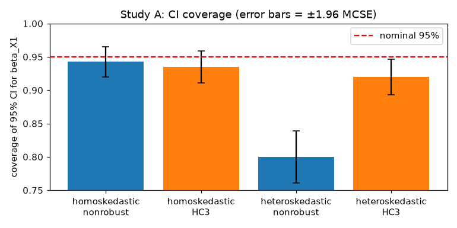
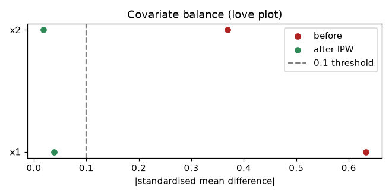
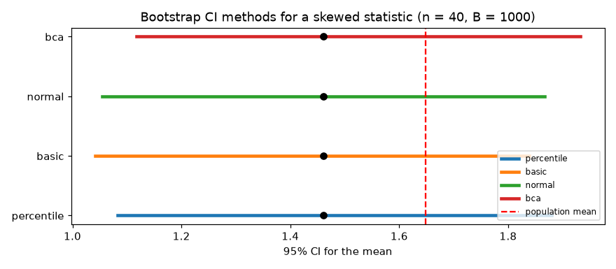
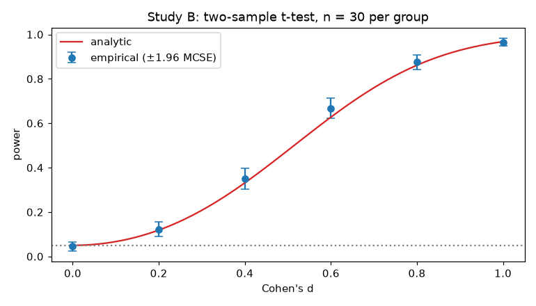

# 🧠 StatsmodelsMasterPro

[](https://github.com/SatvikPraveen/StatsmodelsMasterPro/actions/workflows/ci.yml)
[](https://www.gnu.org/licenses/gpl-3.0)
[](https://www.python.org/)
[](https://www.statsmodels.org/)
[](./tests)
[](https://streamlit.io/)
[](./synthetic_data/MANIFEST.json)

**A research-grade statistical modeling, inference, and validation toolkit built on `statsmodels`.**

Version 2.0 turns a teaching portfolio into a *validated* library: every estimator is
tested against a known data-generating process, every dataset ships with its true
parameters and a SHA-256 hash, and a continuous parameter-recovery study checks that
the intended models recover those parameters. The methodology is documented with
primary references, and the whole thing is exercised through 29 Streamlit pages and
13 notebooks.

---

## What's inside

| Layer | Contents |
|---|---|
| **`utils/` library** (12 modules) | Bootstrap & permutation inference, robust SEs, effect sizes, causal inference (IPW, matching, DiD, 2SLS, RD, E-values), mediation/moderation, ADEMP Monte Carlo framework with MCSE, model selection, time-series evaluation, survival, power, diagnostics battery, publication reporting |
| **Validation** | 147 pytest tests (parameter recovery on simulated DGPs, coverage checks, headless dashboard tests), CI on Python 3.10–3.12, `scripts/parameter_recovery.py` gate |
| **Reproducibility** | `synthetic_data/dgp_registry.py` (true parameters for 17 datasets), `MANIFEST.json` hashes, byte-for-byte regeneration check, generated `docs/DATA_DICTIONARY.md` |
| **Interfaces** | 29 Streamlit pages, 13 Jupyter notebooks, 6 statsmodels-vs-scipy comparison notebooks, CLI/automation scripts, Docker |
| **Docs** | [`docs/METHODOLOGY.md`](docs/METHODOLOGY.md) · [`docs/REPRODUCIBILITY.md`](docs/REPRODUCIBILITY.md) · [`docs/DATA_DICTIONARY.md`](docs/DATA_DICTIONARY.md) · [`CHANGELOG.md`](CHANGELOG.md) · [`CITATION.cff`](CITATION.cff) |

---

## Quick start

```bash
git clone https://github.com/SatvikPraveen/StatsmodelsMasterPro.git
cd StatsmodelsMasterPro
python -m venv .venv && source .venv/bin/activate      # Windows: .venv\Scripts\activate
pip install -e ".[dev,survival,app]"

pytest                                    # run the validation suite (~30 s)
python scripts/verify_manifest.py --regenerate
python scripts/parameter_recovery.py --strict
streamlit run Home.py                     # interactive dashboard at http://localhost:8501
```

Minimal install for library use only: `pip install -e .`

---

## Library tour

```python
import pandas as pd
import statsmodels.formula.api as smf
from utils import inference, causal, simulation, reporting, diagnostics

df = pd.read_csv("synthetic_data/heteroskedastic_data.csv")
ols = smf.ols("y ~ X", data=df).fit()

# 1. Robust and resampling inference
inference.robust_se_table(ols, cov_types=("nonrobust", "HC3", "HAC"))
inference.bootstrap_regression("y ~ X", df, n_boot=1000, method="wild", seed=1)
inference.bootstrap_ci(df["y"], statistic=lambda y: y.mean(), method="bca", seed=1)

# 2. A full assumption battery with flags
diagnostics.diagnostic_battery(ols)

# 3. Publication-ready output
reporting.regression_table([ols, smf.ols("y ~ X + I(X**2)", data=df).fit()], to="latex")
reporting.apa_coefficient(ols, "X")   # 'b = 2.42, SE = 0.18, t(198) = 13.18, p < .001, 95% CI [2.06, 2.78]'

# 4. Validate the estimator itself: does HC3 fix coverage under heteroskedasticity?
res = simulation.monte_carlo(simulation.dgp_linear(n=60, beta=(1, 1), heteroskedastic=True),
                             simulation.ols_estimator("y ~ X1", cov_type="HC3"), n_reps=500, seed=0)
simulation.performance_summary(res, {"beta_X1": 1.0})   # bias, empirical SE, coverage, each with MCSE
```

### `utils/` module map

| Module | Key functions | Reference |
|---|---|---|
| `inference` | `bootstrap_ci` (percentile/basic/normal/**BCa**), `bootstrap_regression` (pairs/residual/**wild**), `permutation_test`, `paired_permutation_test`, `robust_se_table` (HC0–3/HAC/cluster), `wald_test`, `likelihood_ratio_test`, `multiple_testing` | Efron & Tibshirani 1993; DiCiccio & Efron 1996; MacKinnon & White 1985 |
| `effect_sizes` | `cohens_d`, `hedges_g`, `glass_delta`, `cliffs_delta`, `common_language_effect_size`, `anova_effect_sizes` (η²/partial η²/ω²), `cramers_v`, `odds_ratio` | Cohen 1988; Hedges & Olkin 1985 |
| `causal` | `ipw` (ATE/ATT, stabilised, bootstrap), `nearest_neighbor_match` + `matching_att`, `covariate_balance`, `difference_in_differences`, `two_stage_least_squares`, `regression_discontinuity` + `rd_bandwidth_sensitivity`, `e_value` | Rosenbaum & Rubin 1983; Imbens & Lemieux 2008; VanderWeele & Ding 2017 |
| `mediation` | `mediation_analysis` (bootstrap indirect CI, Sobel), `mediation_statsmodels` (ACME/ADE), `moderation_analysis` (simple slopes, Johnson–Neyman) | Preacher & Hayes 2008; Imai et al. 2010 |
| `simulation` | `monte_carlo`, `performance_summary` (bias/SE/RMSE/coverage with **MCSE**), `simulate_power`, `dgp_linear`, `dgp_two_sample`, `dgp_poisson`, `ols_estimator`, `ttest_estimator` | Morris, White & Crowther 2019 |
| `model_selection` | `information_criteria_table` (Akaike weights), `cross_validate`, `best_subset`, `stepwise_selection`, `nested_f_test` | Burnham & Anderson 2002 |
| `reporting` | `tidy`, `glance`, `regression_table` (DataFrame/LaTeX/Markdown/HTML), `apa_coefficient`, `apa_ttest`, `apa_anova`, `coefficient_plot`, `save_table` | APA 7 |
| `time_series_utils` | `stationarity_tests` (ADF+KPSS rule), `auto_arima_order`, `residual_diagnostics`, `rolling_origin_evaluation`, `diebold_mariano`, `granger_causality_matrix`, `forecast_accuracy` | Diebold & Mariano 1995; Harvey et al. 1997 |
| `survival_utils` | `kaplan_meier_table`, `logrank`, `fit_cox`, `check_proportional_hazards`, `parametric_comparison` | Grambsch & Therneau 1994 |
| `power` | `power_ttest`, `power_anova`, `power_proportions`, `power_correlation`, `power_curve`, `minimum_detectable_effect` | Cohen 1988 |
| `diagnostics` | `diagnostic_battery` (BP, White, JB, omnibus, DW, Ljung–Box, Rainbow, RESET, Harvey–Collier, condition number, VIF), `vif_table`, `influence_summary`, plotting helpers | Belsley, Kuh & Welsch 1980 |
| `model_utils`, `compare_models`, `visual_utils`, `mixed_effects_utils` | Original v1 helpers (summaries, Hotelling T², stepwise, plots) | |

Full derivations, assumptions, and the complete reference list are in [`docs/METHODOLOGY.md`](docs/METHODOLOGY.md).

---

## Validation results

Running `python scripts/parameter_recovery.py` fits the intended model to each of the
17 datasets and compares the estimates with the true DGP values recorded in
`synthetic_data/dgp_registry.py`:

| Parameters expected to be recovered | Covered by 95% CI | Largest miss |
|---:|---:|---|
| 57 | 55 (96.5%) | `manova_data` group contrasts, \|z\| ≈ 2.3–2.6 (consistent with nominal coverage) |

The full table is in [`exports/tables/validation/parameter_recovery.md`](exports/tables/validation/parameter_recovery.md).
Deliberately contaminated fits (OLS on outlier data) and population-averaged GEE are reported
but excluded from the gate, because they are *not* supposed to recover the conditional DGP.

Selected results from the Monte Carlo notebooks (each with Monte Carlo standard errors):

<p align="center">
  
  
</p>
<p align="center">
  
  
</p>

---

## Interactive dashboard (29 pages)

```bash
streamlit run Home.py
```

| # | Page | # | Page |
|---|---|---|---|
| 01 | Descriptive statistics | 16 | Summary dashboard |
| 02 | OLS regression | 17 | Robust regression (WLS, RLM, quantile) |
| 03 | GLM families | 18 | Advanced time series (SARIMAX, VAR, VECM, Granger) |
| 04 | Hypothesis tests | 19 | Nonparametric tests |
| 05 | Time series (ARIMA) | 20 | Power analysis |
| 06 | Multivariate stats (Hotelling, MANOVA) | 21 | Survival analysis |
| 07 | Model diagnostics | 22 | Panel data |
| 08 | Model selection | 23 | GEE models |
| 09 | Inference & interpretation | 24 | Mediation & moderation |
| 10 | Post-hoc tests | 25 | Zero-inflated models |
| 11 | t-test comparison (statsmodels vs scipy) | **26** | **Robust & resampling inference** ⭐ |
| 12 | Correlation comparison | **27** | **Causal inference** ⭐ |
| 13 | CI comparison | **28** | **Monte Carlo validation** ⭐ |
| 14 | Bootstrap CI | **29** | **Publication reporting** ⭐ |
| 15 | Distribution simulation | | |

Pages 26–29 are covered by headless `AppTest` smoke tests in CI.

---

## Notebooks

| Notebook | Focus |
|---|---|
| `01_intro_descriptive` … `10_posthoc_analysis` | Foundations: descriptives, OLS, GLM, hypothesis tests, ARIMA, MANOVA, diagnostics, selection, inference, post-hoc |
| `11_robust_and_resampling_inference` ⭐ | HC/HAC/cluster SEs, four bootstrap CI constructions, regression bootstraps, permutation tests, effect sizes, multiplicity |
| `12_causal_inference` ⭐ | IPW, matching, DiD, 2SLS, sharp RD, E-values against stated true effects |
| `13_monte_carlo_validation` ⭐ | ADEMP simulation studies: coverage under heteroskedasticity, empirical vs analytic power, Welch vs pooled type-I error, bootstrap coverage |
| `common_tests/*` | Six head-to-head statsmodels vs scipy comparisons |

Execute all research notebooks with
`jupyter nbconvert --to notebook --execute --inplace notebooks/1[123]_*.ipynb`.

---

## Synthetic datasets (17)

Every dataset is simulated from a fully specified DGP with a fixed seed. True parameters,
column definitions, and hashes are in [`docs/DATA_DICTIONARY.md`](docs/DATA_DICTIONARY.md).

| Dataset | DGP (abridged) | Intended models |
|---|---|---|
| `ols_data` | `y = 2 + 1.5 X1 − 0.7 X2 + N(0, 1.5²)` | OLS |
| `glm_poisson` / `glm_logistic` | `Poisson(exp(0.5 + 0.9 X))` / `logit⁻¹(−0.5 + 0.8 X)` | GLM, Logit |
| `arima_series` | ARMA(1,1): φ = 0.8, θ = 0.4 | ARIMA |
| `heteroskedastic_data` | `y = 3 + 2 X + N(0, (1 + 2\|X\|)²)` | OLS + HC3, WLS |
| `ols_diagnostics` | 10 predictors, collinearity, 10 outliers | Diagnostics, RLM |
| `robust_regression_data` | heteroskedastic + 15 ±30 outliers | RLM, quantile |
| `manova_data`, `multivariate_group_data`, `posthoc_dataset` | group mean shifts | MANOVA, Hotelling T², ANOVA/Tukey |
| `seasonal_ts_data`, `var_data` | trend + period-12 seasonality; VAR(1) | SARIMAX, VAR, Granger |
| `panel_data`, `gee_data` | random intercepts (σ = 5); clustered binary (σ = 3) | FE/RE, GEE |
| `survival_data` | exponential hazard, 40% censoring | KM, Cox PH |
| `zero_inflated_count` | ZIP with inflation on x3 | ZIP/ZINB |
| `mediation_data` | `a = 0.7, b = 0.6, c′ = 0.4`; interaction 0.4 | Mediation, moderation |

```bash
python synthetic_data/generate_datasets.py        # regenerate
python scripts/verify_manifest.py --regenerate     # prove byte-for-byte reproducibility
```

---

## Project structure

```
StatsmodelsMasterPro/
├── utils/                     # Library: inference, causal, simulation, reporting, ...
├── tests/                     # pytest suite (parameter recovery, coverage, AppTest smoke)
├── synthetic_data/            # 17 CSVs, generate_datasets.py, dgp_registry.py, MANIFEST.json
├── scripts/                   # verify_manifest, parameter_recovery, data dictionary, CLI, automation
├── pages/ + Home.py           # Streamlit dashboard (29 pages)
├── notebooks/                 # 13 concept and research notebooks
├── common_tests/              # statsmodels vs scipy comparison notebooks
├── exports/                   # Tables and plots produced by notebooks and validation scripts
├── docs/                      # METHODOLOGY, REPRODUCIBILITY, DATA_DICTIONARY
├── cheatsheets/               # statsmodels / Streamlit / Docker quick references
├── .github/workflows/ci.yml   # lint, tests (3.10-3.12), manifest, dashboard, parameter recovery
├── pyproject.toml             # packaging, extras, pytest/ruff/coverage config
├── Dockerfile, docker-compose.yml, entrypoint.sh
└── CHANGELOG.md, CITATION.cff, CONTRIBUTING.md, CODE_OF_CONDUCT.md, LICENSE
```

---

## Docker

```bash
docker compose up --build                  # JupyterLab on :8899 (default APP_MODE=jupyter)
APP_MODE=streamlit docker compose up --build   # Streamlit on :8501
```

---

## Contributing and citing

Contributions are welcome; see [`CONTRIBUTING.md`](CONTRIBUTING.md). New estimators should
come with a test that recovers a known parameter and, where relevant, a Monte Carlo check of
coverage or size. If you use this project in research, please cite it using
[`CITATION.cff`](CITATION.cff).

## Related projects

[PandasPlayground](https://github.com/SatvikPraveen/PandasPlayground) ·
[NumPyMasterPro](https://github.com/SatvikPraveen/NumPyMasterPro) ·
[MatplotlibMasterPro](https://github.com/SatvikPraveen/MatplotlibMasterPro) ·
[SeabornMasterPro](https://github.com/SatvikPraveen/SeabornMasterPro) ·
[PlotlyVizPro](https://github.com/SatvikPraveen/PlotlyVizPro)

## License

GNU General Public License v3.0. You are free to use, study, share, and modify this
project under the terms of the GPLv3; contributions are licensed the same way.
